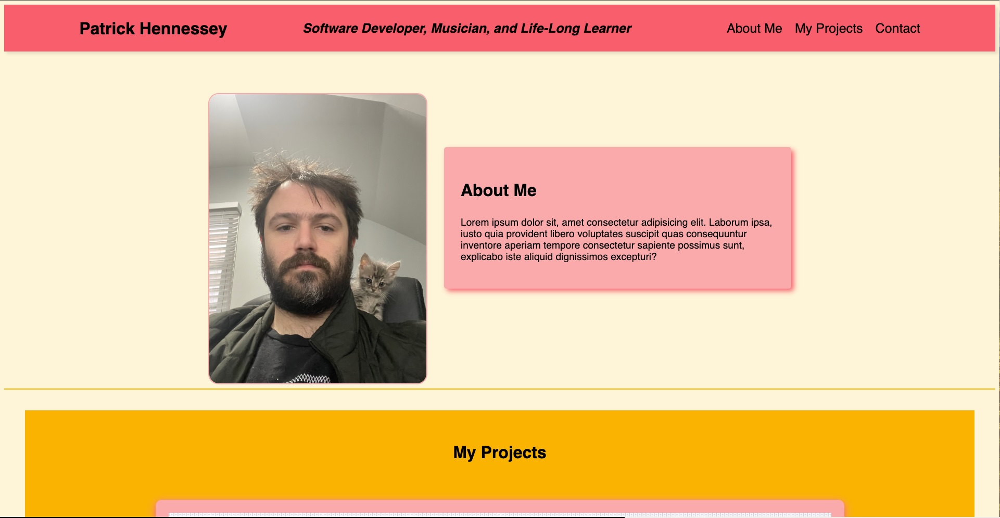

# Portfolio-of-Patrick-Hennessey-Software-Developer

## Description

This project is my portfolio built from scratch using HTML and CSS. It is still a work in progress. Its purpose is to help me find employment as a software developer in the future. It highlights projects I have worked on, my personality, and, to a lesser extent, some of my hobbies and other interests. The portfolio presents my name, a photo of myself, and links to information about me, my projects, and contact information. Some features include a responsive navigation bar, links to my projects and music, my contact information, and links to my GitHub, LinkedIn, and Spotify. I learned extensively about HTML formatting and CSS while working on this project—especially the CSS features of Flexbox, media queries, and CSS variables. 

## Deployed Website

https://rickhennessey87.github.io/Porfolio-of-Patrick-Hennessey-Software-Developer/

## Screenshot 

## Credits 

Patrick Hennessy - https://github.com/RickHennessey87

## License

MIT License

Copyright (c) 2024 RickHennessey87

Permission is hereby granted, free of charge, to any person obtaining a copy
of this software and associated documentation files (the "Software"), to deal
in the Software without restriction, including without limitation the rights
to use, copy, modify, merge, publish, distribute, sublicense, and/or sell
copies of the Software, and to permit persons to whom the Software is
furnished to do so, subject to the following conditions:

The above copyright notice and this permission notice shall be included in all
copies or substantial portions of the Software.

THE SOFTWARE IS PROVIDED "AS IS", WITHOUT WARRANTY OF ANY KIND, EXPRESS OR
IMPLIED, INCLUDING BUT NOT LIMITED TO THE WARRANTIES OF MERCHANTABILITY,
FITNESS FOR A PARTICULAR PURPOSE AND NONINFRINGEMENT. IN NO EVENT SHALL THE
AUTHORS OR COPYRIGHT HOLDERS BE LIABLE FOR ANY CLAIM, DAMAGES OR OTHER
LIABILITY, WHETHER IN AN ACTION OF CONTRACT, TORT OR OTHERWISE, ARISING FROM,
OUT OF OR IN CONNECTION WITH THE SOFTWARE OR THE USE OR OTHER DEALINGS IN THE
SOFTWARE.

## Resources

https://www.freecodecamp.org/

https://www.w3schools.com/

https://developer.mozilla.org/

https://css-tricks.com/

https://hookagency.com/

https://stackoverflow.com/

https://docs.github.com/
